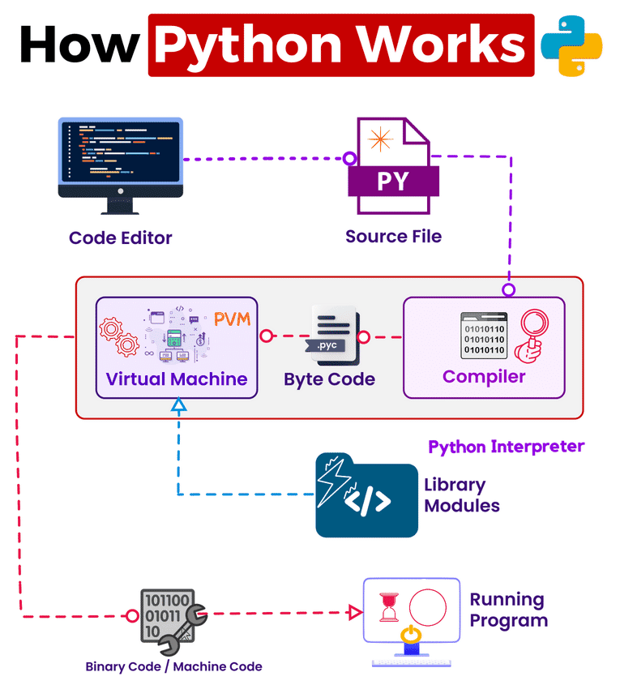

# 🐍 Python Programming - The Basics

Welcome to the exciting world of Python programming! In this section, we will cover the fundamental concepts of Python programming that you will need for your journey into the world of Modern AI.

📚 **Table of Contents**
1.  [What is a Computer? 💻](#1-what-is-a-computer)
2.  [What Do Computers Actually Understand? 🤔](#2-what-do-computers-actually-understand)
3.  [Understanding Bits and Bytes 🧮](#3-understanding-bits-and-bytes)
4.  [How Text Becomes Binary (Encoding) 🔤](#4-how-text-becomes-binary-encoding)
5.  [The Programming Language Bridge 🌉](#5-the-programming-language-bridge)
6.  [Why Python? 🐍](#6-why-python)
7.  [How Programming Languages Work 🔄](#7-how-programming-languages-work)
8.  [The Problem-Solving Mindset 🧩](#8-the-problem-solving-mindset)
9.  [Key Takeaways 🎯](#9-key-takeaways)
10. [Beginner FAQ & Myth-Busting 🙋‍♂️🙋‍♀️](#10-beginner-faq--myth-busting)
11. [Study Questions ❓](#11-study-questions)
12. [Your First Python Program](#your-first-python-program)
13. [Comments](#comments)
14. [Variables](#variables)
15. [Rules for Naming Variables](#rules-for-naming-variables)
16. [Reserved Keywords](#reserved-keywords)
17. [Data Types](#data-types)
18. [Type Casting](#type-casting)
19. [Concatenation](#concatenation)
20. [Summary](#summary)

---

## 1. What is a Computer? 💻

A computer is an incredibly fast machine that can process millions of instructions per second. However, it has some important characteristics:

**What Computers Do Well: ⚡**
*   Perform calculations at lightning speed.
*   Store and retrieve massive amounts of information.
*   Follow instructions exactly as given.
*   Work with numbers, text, images, videos, and more.
*   Never get tired or bored with repetitive tasks.

**What Computers Cannot Do: 🚫**
*   Think creatively or make assumptions.
*   Understand context or "read between the lines."
*   Fix unclear or incomplete instructions.
*   Use common sense to fill in gaps.

**Key Point: 🗝️**
Computers are incredibly powerful but completely literal. They do exactly what you tell them - nothing more, nothing less.

---

## 2. What Do Computers Actually Understand? 🤔

**The Binary World**
Computers only understand binary - a system using just two digits: 0 and 1.

🧠 **Key Insight: Number Systems**

**Decimal System (Base 10) - Our Everyday System**
*   Digits: 0, 1, 2, 3, 4, 5, 6, 7, 8, 9
*   After 9, the next number is 10 (1 carries over, 0 starts a new place).
*   Example: 7, 8, 9, 10, 11, 12...

**Binary System (Base 2) - The Computer's System**
*   Digits: 0, 1
*   After 1, the next number is 10 (1 carries over, 0 starts a new place).
*   Example: 0, 1, 10, 11, 100, 101...

**Explanation**
In everyday life, we use the decimal system (base 10), which has 10 digits (0-9). When we count past 9, we start over at 0 and add 1 to the next place (so 9 + 1 = 10).

Binary works the same way, but with only two digits: 0 and 1. When you count past 1, you start over at 0 and add 1 to the next place (so 1 + 1 = 10 in binary, which is 2 in decimal).

This is why computers use binary: it's simple for circuits (on/off) and follows the same counting rules as our familiar decimal system, just with fewer digits!

Everything a computer processes - your photos, music, videos, text messages, games - is ultimately stored and processed as combinations of 0s and 1s.

**Why Only 0s and 1s?**
*   Computers use electrical circuits.
*   0 = No electrical signal (OFF)
*   1 = Electrical signal present (ON)
*   Like a light switch - it's either ON or OFF, nothing in between.

**Example:**
When you type the letter "A" on your keyboard, the computer actually sees: `01000001`

---

## 3. Understanding Bits and Bytes 🧮

**Analogy:**
Just like we use meters to measure length, kilograms or grams to measure mass, and liters to measure liquids, computers use bytes to measure data. Bytes are the basic measuring unit for digital information.

**Bits 🔹**
*   Bit = Binary digit (either 0 or 1).
*   The smallest unit of information a computer can process.
*   Think of it as a single light switch that can be ON (1) or OFF (0).

**Bytes 🔸**
*   Byte = 8 bits grouped together.
*   One byte can represent 256 different combinations (2^8 = 256).
*   One character (like 'A', 'B', '5', '!') typically takes 1 byte of storage.

**Size Comparison: 📏**
*   1 Byte = 8 bits
*   1 Kilobyte (KB) = 1,024 bytes
*   1 Megabyte (MB) = 1,024 KB
*   1 Gigabyte (GB) = 1,024 MB

**💡 Fun Fact:**
*   The size of your hard drive or SSD (e.g., 256 GB, 1 TB) and your computer's RAM (e.g., 8 GB, 16 GB) are measured in bytes!
*   Your internet speed (e.g., 100 Mbps) is measured in bits per second (b = bit, B = byte). 8 bits = 1 byte, so a 100 Mbps connection can download about 12.5 megabytes per second!

**Visual Example: 👀**
*   Letter 'A' = `01000001` (1 byte = 8 bits)
*   Letter 'B' = `01000010` (1 byte = 8 bits)
*   Letter 'C' = `01000011` (1 byte = 8 bits)

---

## 4. How Text Becomes Binary (Encoding) 🔤

**The Encoding Process**
When you type text, the computer needs to convert each character into binary numbers. This process is called **encoding**.

But here's the challenge: Which character gets which number?

Different encoding systems assign different numbers to characters. It's like having different dictionaries - everyone needs to use the same dictionary to understand each other!

**Two Main Encoding Systems:**
**1. ASCII (1960s - Historical Foundation)**
*   The original encoding system.
*   Only 128 characters (English letters, numbers, basic symbols).
*   Works great for English, but can't handle other languages.
*   Think of it as a small dictionary with only English words.

**2. UTF-8 (1990s - Modern Standard)**
*   The current global standard used everywhere.
*   Can handle over 1 million characters.
*   Includes all world languages, emojis, special symbols.
*   Backward compatible with ASCII (first 128 characters are identical).
*   Think of it as a massive multilingual dictionary.

**Why the Transition Happened:**
*   The Internet went global - people needed to communicate in all languages.
*   Emojis became popular - ASCII couldn't handle 😊 or 🚀.
*   International business - companies needed websites in multiple languages.
*   Mobile devices - people text in their native languages worldwide.

**Today's Reality:**
*   95%+ of websites use UTF-8.
*   All modern programming languages (including Python) default to UTF-8.
*   Your smartphone uses UTF-8 for texts and apps.
*   Social media relies on UTF-8 for global communication.

**The Key Point:**
Both systems do the same job (convert characters to numbers to binary), but UTF-8 can handle much more content. When you learn Python, you're automatically working with UTF-8!

**Text Encoding: From ASCII to UTF-8**
**ASCII: The Foundation (1960s)**
ASCII (American Standard Code for Information Interchange) was the original encoding system:
*   Uses 7 bits (128 possible characters).
*   Only covers English letters, numbers, and basic symbols.
*   Cannot handle accented letters (é, ñ), emojis, or other languages.

| Character | ASCII Number | Binary (8-bit) |
| :-------- | :----------- | :------------- |
| A         | 65           | 01000001       |
| B         | 66           | 01000010       |
| a         | 97           | 01100001       |
| !         | 33           | 00100001       |

**UTF-8: The Modern Standard (Most Common Today)**
UTF-8 (Unicode Transformation Format - 8-bit) is now the global standard:
*   Backward compatible with ASCII (first 128 characters are identical).
*   Can represent over 1 million characters.
*   Handles all world languages: 中文, العربية, русский, हिंदी, 🎉
*   Used by 95%+ of websites today.

**How UTF-8 Works:**
*   Simple characters (A-Z, 0-9): Use 1 byte (same as ASCII).
*   Accented characters (é, ñ): Use 2 bytes.
*   Asian characters (中, 日): Use 3 bytes.
*   Emojis (😊, 🚀): Use 4 bytes.

**Example: Converting "Hi!" vs "Hi! 😊" to Binary**
**"Hi!" (ASCII/UTF-8 - same result):**
*   H = 72 = `01001000`
*   i = 105 = `01101001`
*   ! = 33 = `00100001`

"Hi!" in binary = `01001000 01101001 00100001` (3 bytes)

**"Hi! 😊" (UTF-8 only):**
*   H = `01001000`
*   i = `01101001`
*   ! = `00100001`
*   😊 = `11110000 10011111 10011000 10001010`

"Hi! 😊" in binary = `01001000 01101001 00100001 11110000 10011111 10011000 10001010` (7 bytes)

**The Complete Journey (Modern):**
1.  You type "Hi! 😊" on keyboard.
2.  Computer converts using UTF-8 encoding.
3.  Simple characters use 1 byte, emoji uses 4 bytes.
4.  Computer processes all the binary data.
5.  When displaying, computer converts back: binary → UTF-8 → characters → "Hi! 😊" on screen.

**Why UTF-8 Matters:**
*   **Global communication:** Your Python program can handle any language.
*   **Web compatibility:** Works seamlessly with websites and databases.
*   **Future-proof:** Can handle new emojis and characters as they're added.

---

## 5. The Programming Language Bridge 🌉

**The Communication Problem**
*   Humans think in: Words, concepts, logic.
*   Computers understand: Only 0s and 1s.

Programming languages solve this communication gap!

**Evolution of Programming Languages**
**1. Machine Language (What the Computer Speaks)**
`01001000 01100101 01101100 01101100 01101111`
*   Pure binary/hexadecimal code.
*   Impossible for humans to write efficiently.
*   Direct communication with the computer.

**2. Assembly Language (Slightly Better)**
`MOV AX, 5`
`ADD AX, 3`
*   Uses short words instead of pure numbers.
*   Still very technical and difficult.
*   One step closer to human language.

**3. High-Level Languages (Human-Friendly)**
`result = 5 + 3`
`print(result)`
*   Reads almost like English.
*   Much easier for humans to understand and write.
*   **Python is a high-level language!**

---

## 6. Why Python? 🐍

**What Makes Python Special?**
Python was designed with a philosophy: Code should be readable and simple.

**Python's Advantages:**
*   **Readable:** Looks almost like English.
*   **Beginner-friendly:** Easier to learn than most languages.
*   **Powerful:** Can build websites, analyze data, create AI, control robots.
*   **Popular:** Used by Google, Netflix, Instagram, NASA, Spotify.
*   **Versatile:** Works for many different types of projects.
*   **Great Community:** Lots of help and resources available.

**Real-World Python Usage:**
*   **Instagram:** Built using Python.
*   **Netflix:** Uses Python for movie recommendations.
*   **Google:** Uses Python for many internal tools.
*   **NASA:** Uses Python for space mission calculations.
*   **Spotify:** Python helps create your personalized playlists.
*   **Artificial Intelligence & Machine Learning:** Python is the go-to language for AI research, powering tools like TensorFlow and PyTorch, and used by companies like OpenAI and DeepMind (Google).

---

## 7. How Programming Languages Work 🔄



**The Translation Process**
When you write Python code, here's what happens:

1.  **You write Python code:** `print("Hello World")`
2.  **Python interpreter reads your code:** Checks for errors, understands structure.
3.  **Interpreter converts to machine language:** Translates to binary instructions.
4.  **Computer executes machine language:** Processes the 0s and 1s.
5.  **Result appears:** "Hello World" displays on screen.

**Key Terms:**
*   **Source Code:** The Python code you write.
*   **Interpreter:** Software that translates Python to machine language.
*   **Execution:** When the computer actually runs your program.

---

## 8. The Problem-Solving Mindset 🧩

**Computational Thinking**
Programming is really about breaking down problems into small, logical steps:

**Example: Making a Peanut Butter Sandwich**
**Human instructions:** "Make a PB&J sandwich"
**Computer needs:**
*   Get two slices of bread.
*   Open peanut butter jar.
*   Get knife.
*   Insert knife 2cm into peanut butter.
*   Lift knife with peanut butter.
*   Spread peanut butter on first slice.
*   Clean knife.
*   Open jelly jar.
*   Insert knife 1cm into jelly.
*   ... (and so on)

**The Programmer's Approach: 🧑‍💻**
*   Break down the problem into smaller parts.
*   Think step-by-step - what happens first, second, third?
*   Be specific - assume no common sense.
*   Test your logic - walk through each step mentally.
*   Expect mistakes - debugging is part of programming!

---

## 9. Key Takeaways 🎯

**Remember These Important Points: 📌**
*   Computers only understand binary (0s and 1s).
*   Programming languages are translators between human thinking and computer processing.
*   Python is designed to be readable and beginner-friendly.
*   Programming is problem-solving, not memorizing syntax.
*   Every expert was once a beginner - mistakes are part of learning!

**The Big Picture: 🌍**
When you write `print("Hello World")` in Python:
1.  Python converts your text to binary.
2.  Computer processes the binary instructions.
3.  Binary gets converted back to text for display.
4.  "Hello World" appears on your screen.

You're essentially having a conversation with your computer, using Python as the translator!

---

## 10. Beginner FAQ & Myth-Busting 🙋‍♂️🙋‍♀️

**Common Fears and Misconceptions 😨**

**Q1: Do I need to be good at math to learn programming?**
**Myth!** While some advanced fields use math, most programming (especially in Python) is about logic and problem-solving, not complex math.

**Q2: What if I make mistakes? Will I break my computer?**
**Myth!** Mistakes (bugs) are a normal part of learning. Python will show you error messages, but you can't break your computer by writing code.

**Q3: Is programming only for geniuses?**
**Myth!** Anyone can learn programming with practice and patience. Every expert was once a beginner.

**Q4: Do I need to memorize everything?**
**Myth!** Programming is about problem-solving, not memorization. You can always look up syntax and examples.

**Q5: Is Python too slow or not "real" programming?**
**Myth!** Python is used by top companies and scientists worldwide. It's powerful, versatile, and a great first language.

**Q6: Will I ever understand all of this?**
**Truth:** Learning takes time. It's normal to feel confused at first. Keep practicing, ask questions, and you'll improve!

---

## 11. Study Questions ❓

**Test your understanding:**
1.  What are the only two digits computers understand?
2.  How many bits make up one byte?
3.  What does ASCII stand for and what does it do?
4.  Convert your first name to binary using the ASCII table.
5.  Why can't we program directly in machine language?
6.  What makes Python different from other programming languages?
7.  Name three real-world companies that use Python.
8.  What happens when you run a Python program?

---

## Your First Python Program

Let's write our first Python program. This program will display the text "Hello, World!" on the screen.

```python
print("Hello, World!")
```

When you run this program, you will see the output "Hello, World!". `print()` is a built-in function in Python that is used to display output on the screen.

---

## Comments

Comments are notes that you write in your code. They are not part of the program and are ignored when the program is executed. Comments are used to explain your code to others (and to your future self).

In Python, you can write a single-line comment using the `#` symbol.

```python
# This is a comment
# Roman Urdu Example: Yeh ek tabsarah hai
print("This line will be executed")
```

---

## Variables

Variables are containers for storing data values. You can think of a variable as a labeled box where you can store some information.

To create a variable in Python, you just need to specify the variable name and assign a value to it.

```python
# In this example, 'name' is a variable, and "Ali" is its value.
# Roman Urdu Example: Yahan 'naam' ek mutaghayyar hai aur "Ali" uski qeemat hai.
name = "Ali"
print(name)

# In this example, 'age' is a variable, and 25 is its value.
# Roman Urdu Example: Yahan 'umar' ek mutaghayyar hai aur 25 uski qeemat hai.
age = 25
print(age)
```

### Rules for Naming Variables

When you are naming your variables, you need to follow some rules:

1.  **Allowed Characters:** A variable name can only contain letters (a-z, A-Z), numbers (0-9), and the underscore character (`_`).
2.  **Starting Character:** A variable name must start with a letter or an underscore. It cannot start with a number.
    *   `my_variable` (Correct)
    *   `_my_variable` (Correct)
    *   `9my_variable` (Incorrect)
3.  **Case-Sensitivity:** Python is a case-sensitive language. This means that `myVariable`, `MyVariable`, and `MYVARIABLE` are three different variables.
4.  **Spaces Not Allowed:** Variable names cannot have spaces. If you want to create a variable name with multiple words, use the underscore character to separate them.
    *   `my_name` (Correct)
    *   `my name` (Incorrect)

### Reserved Keywords

In Python, there are some words that are reserved and cannot be used as variable names. These are called **keywords**.

Yahan Python keywords ki list hai:

`False`, `None`, `True`, `and`, `as`, `assert`, `async`, `await`, `break`, `class`, `continue`, `def`, `del`, `elif`, `else`, `except`, `finally`, `for`, `from`, `global`, `if`, `import`, `in`, `is`, `lambda`, `nonlocal`, `not`, `or`, `pass`, `raise`, `return`, `try`, `while`, `with`, `yield`

You don't need to memorize all of these keywords. If you accidentally use a keyword as a variable name, Python will give you an error.

---

## Data Types

In Python, every value has a data type. Data types are used to classify or categorize data items. Python has several built-in data types. Here are some of the most common ones:

*   **String (`str`):** Used for text. A string is a sequence of characters enclosed in single quotes (`'`) or double quotes (`"`).
    *   Example: `"Hello, World!"`, `'Python is fun'`
    *   *Roman Urdu Example:* `"Assalam-o-Alaikum!"`, `'Python mazedar hai'`
*   **Integer (`int`):** Used for whole numbers (positive, negative, or zero).
    *   Example: `10`, `-5`, `0`
    *   *Roman Urdu Example:* `100`, `-20`, `0`
*   **Float (`float`):** Used for numbers with a decimal point.
    *   Example: `3.14`, `-2.5`
    *   *Roman Urdu Example:* `9.99`, `-0.5`
*   **Boolean (`bool`):** Used to represent one of two values: `True` or `False`. Booleans are used in conditional statements and decision-making.
    *   *Roman Urdu Example:* `Sahi`, `Ghalat`

---

## Type Casting

Type casting (or type conversion) is the process of converting a variable from one data type to another. In Python, you can use constructor functions like `int()`, `float()`, and `str()` to convert between data types.

### Integer to String

You can convert an integer to a string using the `str()` function.

```python
age = 25
age_as_string = str(age)

print("My age is " + age_as_string)
# Roman Urdu Example: print("Meri umar " + age_as_string + " saal hai")
```

### String to Integer

You can convert a string to an integer using the `int()` function. This is only possible if the string contains a valid integer.

```python
age_string = "30"
age_integer = int(age_string)

print(age_integer * 2) # Output: 60
# Roman Urdu Example: print(age_integer * 2) # Output: 60
```

If you try to convert a string that is not a valid integer, you will get an error.

```python
invalid_string = "hello"
# The following line will cause an error
# invalid_integer = int(invalid_string)
```

### Float to Integer

You can convert a float to an integer using the `int()` function. The decimal part of the number will be truncated (removed).

```python
price = 99.99
price_as_integer = int(price)

print(price_as_integer) # Output: 99
# Roman Urdu Example: print(price_as_integer) # Output: 99
```

### Integer to Float

You can convert an integer to a float using the `float()` function.

```python
quantity = 10
quantity_as_float = float(quantity)

print(quantity_as_float) # Output: 10.0
# Roman Urdu Example: print(quantity_as_float) # Output: 10.0
```

---

## Concatenation

Concatenation is the process of combining two or more strings together. In Python, you can use the `+` operator to concatenate strings.

```python
first_name = "Smit"
last_name = "Patel"

full_name = first_name + " " + last_name
print(full_name) # Output: Smit Patel
# Roman Urdu Example: print(full_name) # Output: Smit Patel
```

You can also concatenate strings with other data types, but you need to convert them to strings first using the `str()` function.

```python
name = "Ali"
age = 25

# The following line will cause an error because you can't concatenate a string with an integer
# print("My name is " + name + " and my age is " + age)

# You need to convert the integer to a string first
print("My name is " + name + " and my age is " + str(age))
# Roman Urdu Example: print("Mera naam " + name + " hai aur meri umar " + str(age) + " saal hai")
```

Another way to format strings is by using f-strings (formatted string literals). F-strings provide a concise and convenient way to embed expressions inside string literals for formatting.

```python
name = "Aisha"
age = 30

print(f"My name is {name} and my age is {age}")
# Roman Urdu Example: print(f"Mera naam {name} hai aur meri umar {age} saal hai")
```

---

## Summary

In this section, we have learned the fundamental concepts of Python programming. We started with the basics of programming and Python, and then we learned how to write our first Python program. We also discussed how text is converted to binary using encoding.

We then moved on to comments, variables, and the rules for naming variables. We also looked at the reserved keywords in Python that cannot be used as variable names.

Finally, we explored the different data types in Python, including strings, integers, floats, and booleans. We also learned how to convert between different data types using type casting, and how to combine strings using concatenation.

These concepts are the building blocks of Python programming. In the upcoming sections, we will build upon this foundation and explore more advanced topics.
